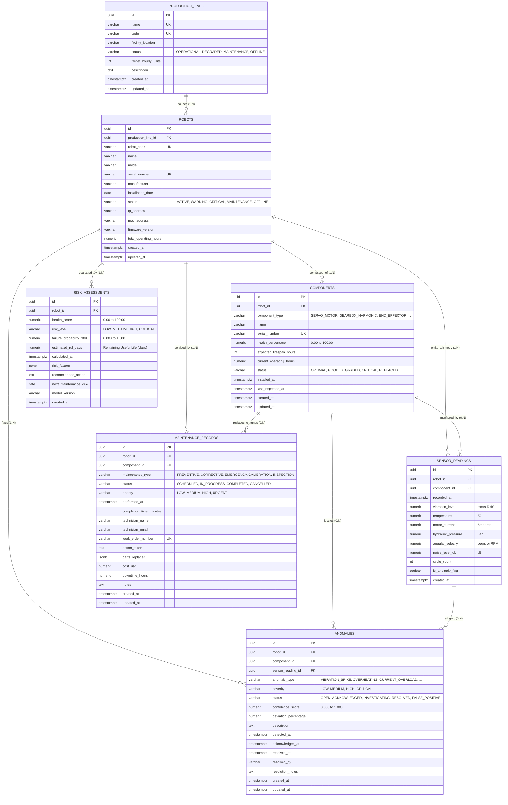

# RoboPulse Database Architecture & Foundation Guide

RoboPulse is an industrial-grade **Robot Health & Predictive Maintenance Platform**. This document details the PostgreSQL schema, entity relationships, constraint policies, indexing strategy, migration system, and operational instructions.

---

## 1. Relational Architecture & ER Diagram

The database is built on **PostgreSQL 16** with UUID primary keys (`gen_random_uuid()`), strict relational integrity, domain-specific `CHECK` constraints, automated `updated_at` triggers, and targeted B-tree indexes.



---

## 2. Table Specifications & Purpose

### 1. `production_lines`
- **Purpose**: Represents physical assembly and manufacturing halls (e.g. Body Welding, Powertrain, Paint Shop, Final Packaging).
- **Key Fields**: `code` (e.g. `PL-WELD-01`), `facility_location`, `status`, `target_hourly_units`.
- **Constraint Policies**:
  - `status`: Restricted to `('OPERATIONAL', 'DEGRADED', 'MAINTENANCE', 'OFFLINE')`.
  - `target_hourly_units >= 0`.

### 2. `robots`
- **Purpose**: Stores individual industrial articulated robot arms, SCARA, gantry, and welding manipulators.
- **Key Fields**: `robot_code` (e.g. `RB-WELD-101`), `model`, `serial_number`, `manufacturer`, `total_operating_hours`, `firmware_version`.
- **Constraint Policies**:
  - `production_line_id`: Foreign key with `ON DELETE RESTRICT` (prevents accidental deletion of lines housing active robots).
  - `status`: Restricted to `('ACTIVE', 'WARNING', 'CRITICAL', 'MAINTENANCE', 'OFFLINE')`.
  - `total_operating_hours >= 0.00`.

### 3. `components`
- **Purpose**: Tracks sub-assemblies susceptible to wear and fatigue (joint servo motors, harmonic reducers, weld guns, hydraulic pumps).
- **Key Fields**: `component_type`, `health_percentage`, `expected_lifespan_hours`, `current_operating_hours`, `status`.
- **Constraint Policies**:
  - `robot_id`: Foreign key with `ON DELETE CASCADE`.
  - `component_type`: Restricted to `('SERVO_MOTOR', 'GEARBOX_HARMONIC', 'END_EFFECTOR', 'HYDRAULIC_ACTUATOR', 'COOLING_SYSTEM', 'ENCODER', 'POWER_SUPPLY', 'CONTROLLER_BOARD')`.
  - `health_percentage`: Bounded between `0.00` and `100.00`.

### 4. `sensor_readings`
- **Purpose**: High-throughput telemetry stream recording physical metrics (vibration RMS, operating temperature, drive current, hydraulic pressure, angular speed, noise dB).
- **Key Fields**: `recorded_at`, `vibration_level`, `temperature`, `motor_current`, `hydraulic_pressure`, `is_anomaly_flag`.
- **Constraint Policies**:
  - Physical numeric checks: `temperature >= -40 AND temperature <= 250`, `motor_current >= 0 AND motor_current <= 500`, `vibration_level >= 0`.

### 5. `anomalies`
- **Purpose**: Tracks threshold breaches, predictive alert signals, and failure incidents for triage and root-cause analysis.
- **Key Fields**: `anomaly_type`, `severity`, `status`, `confidence_score`, `deviation_percentage`, `detected_at`, `resolved_by`.
- **Constraint Policies**:
  - `anomaly_type`: Restricted to `('VIBRATION_SPIKE', 'OVERHEATING', 'CURRENT_OVERLOAD', 'HYDRAULIC_PRESSURE_DROP', 'BEARING_WEAR', 'ENCODER_DRIFT', 'THERMAL_RUNAWAY', 'TORQUE_DISCREPANCY')`.
  - `severity`: Restricted to `('LOW', 'MEDIUM', 'HIGH', 'CRITICAL')`.
  - `status`: Restricted to `('OPEN', 'ACKNOWLEDGED', 'INVESTIGATING', 'RESOLVED', 'FALSE_POSITIVE')`.
  - `confidence_score`: Bounded between `0.000` and `1.000`.

### 6. `maintenance_records`
- **Purpose**: Logs work orders, repairs, calibrations, preventive cycles, and emergency component replacements.
- **Key Fields**: `maintenance_type`, `status`, `priority`, `work_order_number`, `technician_name`, `parts_replaced` (JSONB), `cost_usd`, `downtime_hours`.
- **Constraint Policies**:
  - `maintenance_type`: Restricted to `('PREVENTIVE', 'CORRECTIVE', 'EMERGENCY', 'CALIBRATION', 'INSPECTION')`.
  - `priority`: Restricted to `('LOW', 'MEDIUM', 'HIGH', 'URGENT')`.
  - `cost_usd >= 0.00`, `downtime_hours >= 0.00`.

### 7. `risk_assessments`
- **Purpose**: Stores predictive maintenance outputs, AI-computed failure probabilities, Remaining Useful Life (RUL) estimates, and actionable engineering recommendations.
- **Key Fields**: `health_score`, `risk_level`, `failure_probability_30d`, `estimated_rul_days`, `calculated_at`, `risk_factors` (JSONB).
- **Constraint Policies**:
  - `health_score`: Bounded between `0.00` and `100.00`.
  - `risk_level`: Restricted to `('LOW', 'MEDIUM', 'HIGH', 'CRITICAL')`.
  - `failure_probability_30d`: Bounded between `0.000` and `1.000`.
  - `estimated_rul_days >= 0.00`.

---

## 3. Indexing Strategy & Performance Justifications

| Index Name | Target Table | Indexed Columns | Query Pattern & Rationale |
|---|---|---|---|
| `idx_robots_production_line_id` | `robots` | `(production_line_id)` | Enables fast joins and filtering of all robots belonging to a production line. |
| `idx_robots_status` | `robots` | `(status)` | Quickly identifies all offline, warning, or critical robots across the entire plant. |
| `idx_components_robot_id` | `components` | `(robot_id)` | Speeds up retrieval of sub-assemblies for robot health cards and maintenance audits. |
| `idx_components_type_status` | `components` | `(component_type, status)` | Powers component inventory views and failure analysis by component category. |
| `idx_sensor_readings_robot_recorded_at` | `sensor_readings` | `(robot_id, recorded_at DESC)` | **Primary Telemetry Index**: Essential for querying time-series historical charts, latest status, and trend analysis. |
| `idx_sensor_readings_component_recorded_at` | `sensor_readings` | `(component_id, recorded_at DESC)` | Fetches component-specific telemetry histories. |
| `idx_sensor_readings_is_anomaly` | `sensor_readings` | `(is_anomaly_flag) WHERE is_anomaly_flag = TRUE` | **Partial Index**: Extremely compact; provides instant access to anomalous telemetry points without scanning millions of normal readings. |
| `idx_anomalies_robot_status` | `anomalies` | `(robot_id, status)` | Filters active/open incident alerts for specific robotic assets. |
| `idx_anomalies_severity_status` | `anomalies` | `(severity, status)` | Powers critical incident triage queues in the dashboard. |
| `idx_anomalies_detected_at` | `anomalies` | `(detected_at DESC)` | Chronological plant-wide alert feed. |
| `idx_maintenance_records_robot_performed_at` | `maintenance_records` | `(robot_id, performed_at DESC)` | Fetches service history and maintenance logs for a robot. |
| `idx_maintenance_records_component_id` | `maintenance_records` | `(component_id)` | Tracks component replacement history and warranty claims. |
| `idx_risk_assessments_robot_calculated_at` | `risk_assessments` | `(robot_id, calculated_at DESC)` | Retrieves the most recent AI predictive health score and RUL estimate for each robot. |
| `idx_risk_assessments_risk_level` | `risk_assessments` | `(risk_level)` | Immediately surfaces HIGH and CRITICAL risk robots to maintenance dispatchers. |

---

## 4. How to Run Migrations, Seeds & Verification

### Step 1: Start PostgreSQL via Docker Compose
```bash
docker compose up -d postgres
```
*PostgreSQL will be running on host port `5433` (`localhost:5433`, db: `robopulse`, user: `robopulse_user`, password: `robopulse_password`).*

### Step 2: Install Node.js Dependencies
```bash
npm install
```

### Step 3: Run Database Migrations
```bash
npm run db:migrate
```
*Creates the `schema_migrations` table, enables `pgcrypto`, builds all 7 tables, attaches update triggers, and creates all 16 performance indexes.*

### Step 4: Seed Realistic Manufacturing Data
```bash
npm run db:seed
```
*Populates 4 production lines, 8 robots, 32 components, 150+ time-series sensor readings, 10 correlated anomalies, 8 maintenance records with JSONB spare parts, and 8 AI risk assessments with RUL metrics.*

### Step 5: Run Automated Verification & Diagnostics
```bash
npm run db:verify
```
*Validates table counts, checks for foreign key orphans, confirms all indexes exist, and executes 5 real-world analytical queries.*

### Optional: Clean Reset
```bash
npm run db:reset
```
*Drops all tables, functions, triggers, and migration tracking for a clean restart.*

---

## 5. Sample Analytical Queries

### Query A: Plant-Wide High Risk & Low Health Fleet Summary
```sql
SELECT 
    p.name AS production_line,
    r.robot_code,
    r.name AS robot_name,
    r.status AS robot_status,
    ra.health_score,
    ra.risk_level,
    ra.failure_probability_30d,
    ra.estimated_rul_days,
    ra.recommended_action
FROM robots r
JOIN production_lines p ON r.production_line_id = p.id
JOIN LATERAL (
    SELECT * FROM risk_assessments 
    WHERE robot_id = r.id 
    ORDER BY calculated_at DESC 
    LIMIT 1
) ra ON true
ORDER BY ra.health_score ASC;
```

### Query B: Correlated Sensor Spikes for Active Unresolved Anomalies
```sql
SELECT 
    r.robot_code,
    a.anomaly_type,
    a.severity,
    a.status AS anomaly_status,
    a.confidence_score,
    s.recorded_at,
    s.vibration_level,
    s.temperature,
    s.motor_current,
    s.hydraulic_pressure,
    c.name AS component_name
FROM anomalies a
JOIN robots r ON a.robot_id = r.id
LEFT JOIN components c ON a.component_id = c.id
LEFT JOIN sensor_readings s ON a.sensor_reading_id = s.id
WHERE a.status IN ('OPEN', 'INVESTIGATING')
ORDER BY a.detected_at DESC;
```
